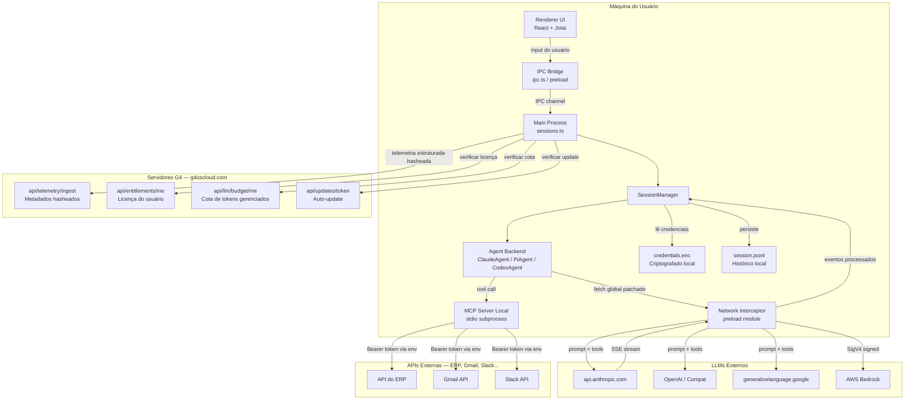
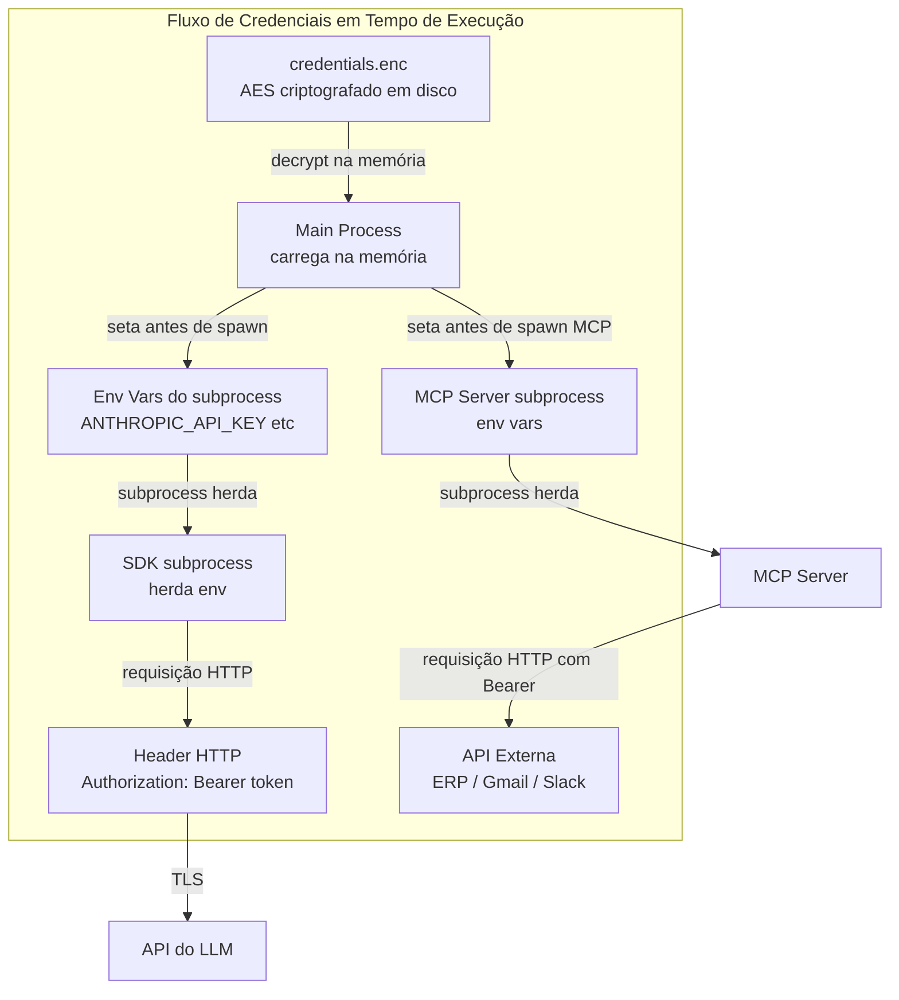
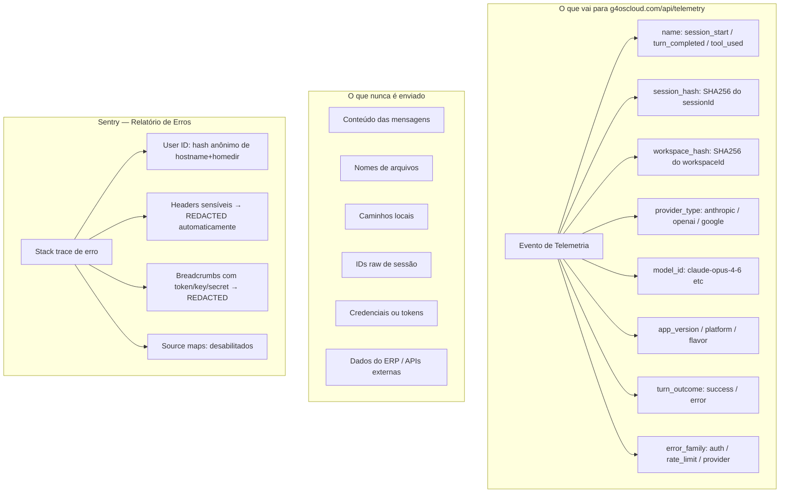

## Resumo rápido

O G4 OS foi desenhado com uma arquitetura `local-first`.

No fluxo padrão, ele funciona como um orquestrador local: credenciais, histórico de sessões, configuração de fontes e chamadas para APIs externas ficam na sua máquina. Quando você conecta ERP, Gmail, Slack ou outras ferramentas via APIs próprias ou MCPs locais, a chamada sai da sua máquina para o destino final, sem a G4 atuar como proxy intermediário desse tráfego.

Isso não significa que nada nunca saia do seu ambiente. Significa que o fluxo principal do produto não depende de espelhar seus dados operacionais em servidores da G4 para funcionar.

## Como funciona na prática

### Visão geral: o que sai de onde

O diagrama abaixo mostra o fluxo completo — o que roda na máquina do usuário, o que vai para os LLMs externos, o que chega aos servidores da G4 e como as APIs de terceiros são acessadas pelo sistema. 



**Ponto central:** chamadas para ERP, Gmail, Slack e similares saem diretamente da máquina do usuário via MCP subprocess — sem passar pelos servidores da G4.

### Fluxo local padrão em texto

```text
Interface do G4 OS
  -> execução local no seu computador
    -> provedor de IA escolhido por você
    -> APIs e sistemas externos conectados por você
```

### O que isso quer dizer

- o G4 OS roda e orquestra a operação localmente
- chamadas para APIs externas saem da máquina do usuário nos fluxos locais
- o conteúdo enviado ao modelo vai para o provedor de IA selecionado, não para a G4
- a G4 não precisa armazenar o histórico completo do seu workspace para a operação padrão funcionar

## O que normalmente fica local

No fluxo local padrão, estes itens permanecem no ambiente do usuário:

| Tipo de dado | Onde fica |
| --- | --- |
| Credenciais e tokens | armazenamento local criptografado |
| Histórico de sessões | arquivos locais do workspace |
| Configuração de fontes | arquivos locais do workspace |
| Arquivos e contexto do projeto | diretórios e workspaces locais |

### Como as credenciais circulam em tempo de execução

As credenciais nunca aparecem em logs, nunca ficam em disco durante a execução e nunca são incluídas na telemetria. O fluxo abaixo mostra o ciclo completo desde o armazenamento criptografado até o uso nas requisições.



## O que pode sair da sua máquina

Alguns dados precisam sair do seu ambiente para que o produto funcione:

- prompts e contexto enviados ao provedor de IA que você escolheu
- chamadas para APIs externas conectadas por você
- metadados técnicos limitados para autenticação, licenciamento, updates e telemetria operacional

## O que a G4 recebe no fluxo do produto

A plataforma pode receber dados técnicos necessários para operar o serviço, como:

- autenticação e entitlement da conta
- verificação de orçamento quando você usa recursos gerenciados
- checagem de updates
- telemetria técnica e estruturada do produto

No caso da telemetria, o produto usa identificadores hasheados para sessão e workspace em vez de IDs brutos, e o objetivo é medir uso técnico do sistema, não o conteúdo do que foi escrito.

### O que a telemetria envia — e o que ela nunca envia



A telemetria é **comportamental e estruturada** — registra que uma sessão aconteceu, com qual modelo e com qual resultado. Nunca o conteúdo.

## Resumo: o que a G4 monitora de fato

| Canal | O que vai | O que não vai |
| --- | --- | --- |
| **Telemetria** | Tipo de evento (hasheado), modelo usado, resultado (success/error), versão do app | Conteúdo de mensagens, dados do ERP, credenciais |
| **Sentry** | Stack trace de erros, versão, plataforma | Headers de auth (redactados), conteúdo de prompt |
| **Entitlement** | Email de login, licença ativa | Dados de sessão |
| **Budget** | Contagem de tokens consumidos | Conteúdo dos prompts |
| **Updates** | Versão instalada | Qualquer dado de sessão |

## O que a G4 não precisa receber no fluxo local padrão

No fluxo local padrão, a G4 não precisa receber:

- credenciais e chaves das suas integrações
- histórico completo das suas sessões para operar o app
- dados retornados por ERP, CRM ou APIs conectadas localmente
- caminhos locais e estrutura completa dos seus arquivos como base de operação da plataforma

## Quando essa arquitetura muda

Existem situações em que a infraestrutura da plataforma participa mais do fluxo. É importante deixar isso explícito.

### Conexões gerenciadas

`Conexões Gerenciadas` podem usar infraestrutura da plataforma para autenticação, catálogo, status e partes do runtime da integração.

Isso é diferente de uma API ou MCP puramente local. Se o objetivo for maximizar isolamento e previsibilidade do tráfego, prefira integrações locais ou MCPs que rodam no seu próprio ambiente.

### Recursos cloud opcionais

Recursos como `Cloud Sync`, colaboração e outras funções de nuvem mudam o fluxo porque, por definição, sincronizam parte dos dados com a infraestrutura da plataforma.

Esses recursos existem para backup, colaboração e continuidade, não porque o produto precise centralizar todo o seu contexto por padrão.

### Provedores e recursos gerenciados

Quando você usa provedores gerenciados, créditos da plataforma ou agentes gerenciados, parte do controle operacional passa pelos serviços da G4 para autenticação, orçamento, catálogo e roteamento técnico da funcionalidade.

Ainda assim, isso não transforma o G4 OS em um espelho permanente de todo o seu workspace.

## Como pensar segurança na prática

- use suas próprias chaves e integrações quando quiser o maior controle possível
- prefira APIs próprias e MCPs locais para sistemas sensíveis
- deixe recursos cloud opcionais desligados quando a política exigir operação mais local
- revise permissões, fontes e workspaces antes de ampliar automações

## Em uma frase

O G4 OS foi pensado para operar com contexto e execução perto do usuário, não para depender de copiar todo o contexto da empresa para a nuvem da G4.

<Columns cols={2}>
  <Card title="Ver segurança e controle" icon="shield-check" href="/product/security">
    Entenda como o network interceptor, permissões e governança entram na operação com IA.
  </Card>

  <Card title="Ver conexões" icon="plug" href="/product/connections">
    Compare conexões gerenciadas, agentes gerenciados, MCPs e APIs.
  </Card>
</Columns>