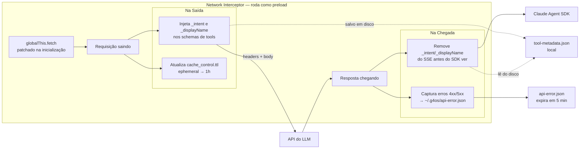

## IA com governança operacional

Para gerar valor real no time, IA precisa de contexto e autonomia na medida certa, mas também precisa de controle.

O G4 OS foi desenhado para equilibrar velocidade com governança operacional.

## O que isso significa na prática

- controle sobre acessos e permissões
- regras sobre uso de ferramentas e fontes
- separação de contexto por workspace e sessão
- limites claros para fluxos recorrentes e automações

## Network Interceptor: transparência no tráfego com os LLMs

O G4 OS usa um `Network Interceptor` que roda como módulo de preload e intercepta as requisições antes de chegarem ao SDK do LLM. Ele não monitora o conteúdo das mensagens — existe para três funções específicas:

1. **Injetar metadados de UI nas tools** — para mostrar feedback como "Buscando email..." na interface durante execução de tools
2. **Otimizar o cache de prompts** — ajusta o TTL de `cache_control` para 1 hora, reduzindo custo e latência em sessões longas
3. **Capturar erros HTTP localmente** — salva erros 4xx/5xx em arquivo local temporário (`~/.g4os/api-error.json`, expira em 5 min) para diagnóstico

## Como pensar segurança no início

Não trate segurança como uma camada posterior. Defina desde cedo:

- quais fontes podem ser usadas
- quem pode acessar cada contexto
- quais tarefas podem ser automatizadas
- quando revisão humana continua obrigatória

## Permissões e modos de execução

O G4 OS oferece modos de permissão para controlar o nível de autonomia dos agentes em cada sessão:

| Modo | Comportamento |
| --- | --- |
| **Explorar** | Somente leitura. Agente pesquisa, lê e guia, sem executar ações. |
| **Perguntar antes de editar** | Leituras livres. Agente solicita aprovação antes de qualquer escrita ou ação. |
| **Executar** | Execução autônoma completa. Indicado para fluxos revisados e rotinas automatizadas. |

## Escale com confiança

Quanto melhor forem os limites e as regras desde o início, mais fácil fica expandir o uso do G4 OS para novas áreas, times e casos de uso.

<Columns cols={2}>
  <Card
    title="Entender privacidade e dados"
    icon="shield"
    href="/product/privacy-and-data"
  >
    Veja a arquitetura completa com diagramas: o que fica local, como as credenciais circulam e o que a telemetria envia.
  </Card>
  <Card
    title="Ver permissões detalhadas"
    icon="sliders"
    href="/support/permissions"
  >
    Entenda como configurar modos de permissão, comandos permitidos e bloqueados dentro do app.
  </Card>
</Columns>
