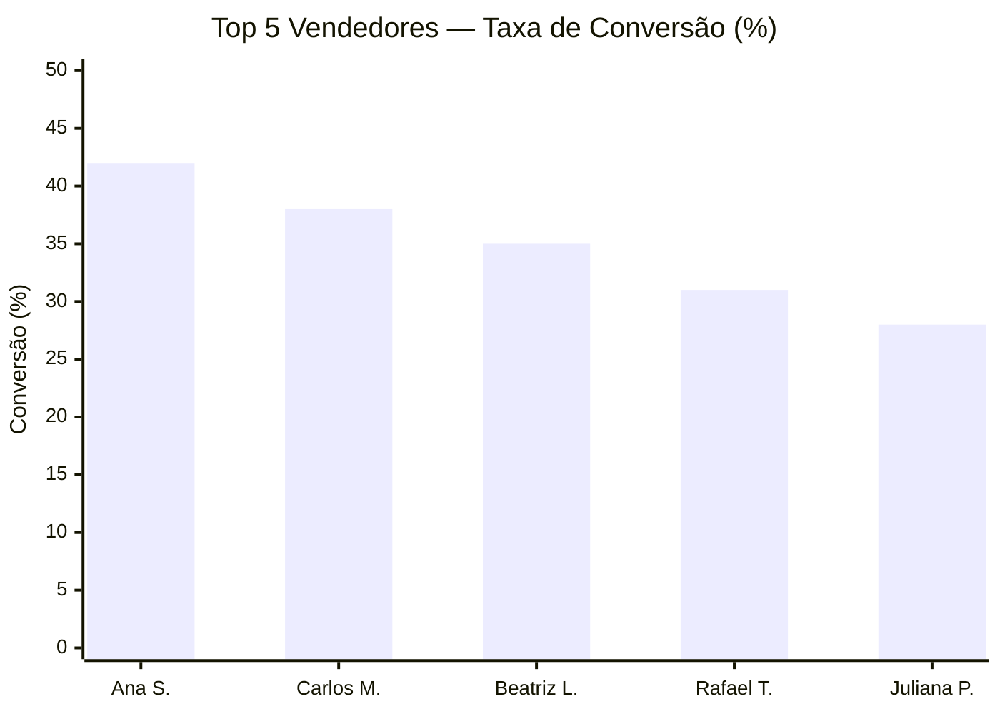

## O que este caso de uso cobre

Análise de **performance do time comercial** com granularidade em nível de deal individual — conversão por vendedor, perfil do lead por origem, ciclo de venda e ramp de novos vendedores. O G4 OS processa mais de 38 mil registros, gera rankings e gráficos Mermaid comparativos.

## Dataset de exemplo

<Card
  title="nexus_performance_comercial.xlsx"
  icon="table"
  href="https://raw.githubusercontent.com/Gestao-Quatro-Ponto-Zero/g4os-docs/main/use-cases/datasets/nexus_performance_comercial.xlsx"
>
  Baixar dataset — 38.213 deals individuais + ranking de vendedores (3.3 MB, 4 abas)
</Card>

### O que tem dentro

**4 abas:**

| Aba | Conteúdo | Linhas |
|-----|----------|--------|
| `Deals Individuais` | Um registro por deal com vendedor e resultado | 38.213 |
| `Ranking Vendedores` | Vendedor × mês com métricas agregadas | 360 |
| `Perfil de Lead` | Breakdown de perfil por origem de canal | série mensal |
| `Ramp Vendedores` | Curva de ramp de novos vendedores | por contratação |

**Campos principais:**

| Campo | Descrição |
|-------|-----------|
| `vendedor` | Nome do vendedor (anonimizado) |
| `equipe` | Time de vendas (Inside Sales, Selfcheckout, etc.) |
| `origem_lead` | Canal que gerou o lead |
| `perfil_lead` | Segmento do lead |
| `produto` | Produto negociado |
| `status` | Ganho / Perdido / Em andamento |
| `motivo_perda` | Motivo de perda quando aplicável |
| `ciclo_dias` | Dias do primeiro contato ao fechamento |
| `ticket` | Valor do deal |

## Abrir no G4 OS

<Card
  title="Analisar performance comercial no G4 OS"
  icon="sparkles"
  href="g4os://action/new-session?input=Faca+o+download+do+dataset+nexus_performance_comercial.xlsx+em+https%3A%2F%2Fraw.githubusercontent.com%2FGestao-Quatro-Ponto-Zero%2Fg4os-docs%2Fmain%2Fuse-cases%2Fdatasets%2Fnexus_performance_comercial.xlsx+e+execute%3A+%281%29+carregue+as+4+abas%2C+%282%29+calcule+taxa+de+conversao+e+ticket+medio+por+vendedor%2C+%283%29+compare+performance+por+perfil+de+lead+e+origem%2C+%284%29+gere+um+grafico+Mermaid+de+barras+com+ranking+dos+top+10+vendedores+por+receita%2C+%285%29+analise+ciclo+de+venda+por+produto+e+equipe%2C+%286%29+gere+grafico+de+linha+com+curva+de+ramp+media+dos+vendedores%2C+%287%29+entregue+ranking+executivo+com+insights+e+pontos+de+atencao+por+vendedor.&send=true&mode=execute&workdir=none"
>
  Abrir sessão — executa automaticamente no modo Execute
</Card>

### O que o G4 OS faz ao abrir

1. Baixa e processa as 4 abas do dataset
2. Calcula taxa de conversão e ticket médio por vendedor
3. Compara performance por perfil de lead e origem
4. Gera ranking Mermaid dos top 10 vendedores por receita
5. Analisa ciclo de venda por produto e equipe
6. Gera curva de ramp média dos vendedores
7. Entrega ranking executivo com insights e pontos de atenção

## Análises possíveis com este dataset

- **Ranking de vendedores** — por volume, conversão e ticket médio simultaneamente
- **Qualidade por origem** — quais canais geram leads com melhor taxa de fechamento
- **Ciclo de venda** — produtos e perfis com ciclo mais curto e mais longo
- **Motivos de perda** — o que impede o fechamento e como varia por equipe
- **Curva de ramp** — quanto tempo leva para um novo vendedor atingir produtividade plena
- **Sazonalidade comercial** — quais meses concentram mais deals ganhos e perdidos

### Exemplo de gráfico Mermaid que o G4 OS pode gerar

## Veja também

- [Funil de Marketing](/use-cases/marketing-vendas/funil-marketing) — de onde vêm os leads que entram no pipeline
- [Cohort de Receita](/use-cases/marketing-vendas/cohort-receita) — retenção dos clientes fechados por cada equipe
- [Churn e Retenção](/use-cases/marketing-vendas/churn-retencao) — correlação entre vendedor/origem e churn futuro
